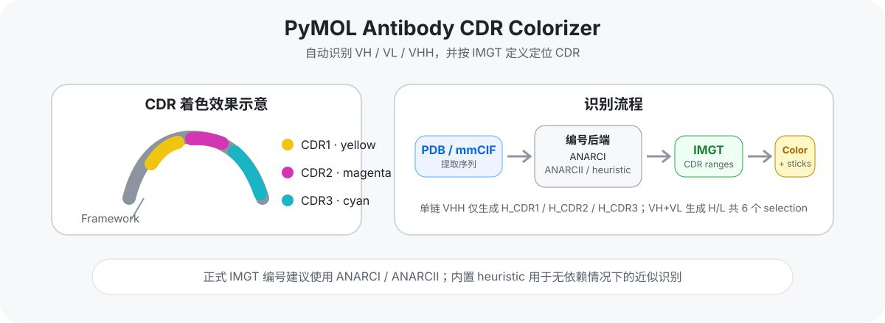

<h1 align="center">PyMOL Antibody CDR Colorizer</h1>

<p align="center">
  PyMOL 抗体 CDR 自动识别与着色插件，支持 <strong>VH / VL / VHH / Nanobody</strong>。
</p>

<p align="center">
  
  
  
  
</p>

---

**PyMOL Antibody CDR Colorizer** 用于在 PyMOL 中自动识别抗体可变区，并按照 **IMGT CDR 定义**对 CDR1、CDR2、CDR3 进行着色。

插件同时支持常规 **VH + VL 抗体**和单域 **VHH / Nanobody**，并提供中文 GUI、自动扫描、sticks 显示、selection 创建以及命令行接口。



## 主要功能

- 🧬 **自动识别抗体可变域**：打开 PDB / mmCIF 后可扫描 VH、VL 和 VHH。
- 🦙 **支持 VHH / Nanobody**：单独加载 VHH 时不要求存在配对轻链。
- 🎨 **CDR 自动着色**：CDR1、CDR2、CDR3 使用独立颜色。
- 📐 **IMGT CDR 定义**：
  - CDR1：27–38
  - CDR2：56–65
  - CDR3：105–117
- 🖥️ **中文 GUI**：结构对象、颜色、sticks、自动处理等均可通过面板操作。
- 🧱 **生成 PyMOL selections**：方便继续做界面分析、距离测量、展示和出图。
- 🪄 **可选 sticks 显示**：一键突出 CDR 侧链。
- ⚙️ **多级识别后端**：优先使用 ANARCI，其次 ANARCII；均不可用时自动降级到内置 heuristic。
- 🍎 **macOS / Homebrew 兼容**：自动寻找 `hmmscan`，解决 Finder/Launchpad 启动 PyMOL 时 PATH 丢失的问题。

## 快速安装

### 1. 下载插件

直接下载仓库中的插件 ZIP：

**[antibody_cdr_pymol_plugin_v1.3.0.zip](dist/antibody_cdr_pymol_plugin_v1.3.0.zip)**

### 2. 在 PyMOL 中安装

依次打开：

```text
Plugin
  → Plugin Manager
  → Install New Plugin
```

选择下载好的 ZIP 文件。

安装完成后建议重启 PyMOL，然后打开：

```text
Plugin
  → 抗体 CDR 自动识别与着色
```

## 基本使用

### GUI

插件面板支持：

- 选择结构对象
- 设置 CDR1 / CDR2 / CDR3 颜色
- 自动处理新加载结构
- 是否显示 CDR sticks
- 识别并着色当前结构
- 扫描全部结构
- 删除插件生成的 CDR selections

默认颜色：

| 区域 | 默认颜色 |
|---|---|
| CDR1 | `yellow` |
| CDR2 | `magenta` |
| CDR3 | `cyan` |

## PyMOL 命令

插件同时保留命令行接口。

### 自动识别并着色

```text
cdr_color
```

指定对象：

```text
cdr_color my_object
```

自定义颜色并显示 sticks：

```text
cdr_color my_vhh, yellow, magenta, cyan, 1
```

完整参数：

```text
cdr_color selection, CDR1颜色, CDR2颜色, CDR3颜色, sticks
```

### 查看识别信息

```text
cdr_info my_object
```

### 自动处理新加载结构

开启：

```text
cdr_auto 1
```

关闭：

```text
cdr_auto 0
```

### 查看当前识别后端

```text
cdr_backend
```

该命令可用于确认：

- 当前使用的是 ANARCI、ANARCII 还是 heuristic
- `hmmscan` 的实际路径
- PyMOL 当前使用的 Python 路径

### 删除 CDR selections

```text
cdr_clear my_object
```

## CDR 识别原理

插件首先从 PyMOL 结构中提取氨基酸序列，再进行抗体编号和 CDR 映射。

识别优先级：

```text
ANARCI
  ↓
ANARCII
  ↓
内置 heuristic
```

### ANARCI

如果 PyMOL 的 Python 环境可以导入 ANARCI，并且能够找到 HMMER 的 `hmmscan`，插件会优先使用 ANARCI 完成 IMGT 编号。

### ANARCII

ANARCI 不可用或编号失败时，会尝试 ANARCII。

### 内置 heuristic

如果两个正式编号后端都不可用，插件会使用内置序列启发式算法。

该模式针对 VHH 做了额外兼容，包括：

- 允许较长 CDR3
- 允许 CDR3 中存在额外 Cys
- 不依赖配对轻链
- 不强制要求结构链名为 `H` / `L`
- 优先根据序列特征判断重链型与轻链型可变域

> **注意：** heuristic 是近似识别，不能替代正式抗体编号。用于正式分析、结构比较或需要精确 IMGT 编号时，建议安装 ANARCI 或 ANARCII。

## VHH / Nanobody 支持

VHH 的 CDR3 往往比常规 VH 更长，并且可能存在额外 Cys 或非经典二硫键。

旧式基于“FR4 前最后一个 Cys”的简单规则容易误判 CDR3 起点，因此当前版本的 fallback 逻辑改为：

1. 定位 C 端 FR4 motif；
2. 向前寻找 FR3 末端的保守 Cys；
3. 允许 CDR3 内继续存在一个或多个 Cys；
4. 单独的 VHH 可以直接识别，不要求配对 VL；
5. 不依赖 PDB 中是否使用标准 `H` / `L` chain ID。

## 插件生成的 selections

### 单链 VHH / 单独 VH

检测到一个重链型可变域时生成：

```text
abCDR_myVHH_H_CDR1
abCDR_myVHH_H_CDR2
abCDR_myVHH_H_CDR3
```

### 常规 VH + VL

生成 6 个 selections：

```text
abCDR_myFab_H_CDR1
abCDR_myFab_H_CDR2
abCDR_myFab_H_CDR3

abCDR_myFab_L_CDR1
abCDR_myFab_L_CDR2
abCDR_myFab_L_CDR3
```

κ 和 λ 轻链统一以 `L` 标识。

如果同一个 PyMOL 对象中存在多个 H 或多个 L 可变域，插件会自动将原始 chain ID 加入 selection 名称，避免重名。

重新识别时，插件会先清除该对象旧的 `abCDR_*` selections。

## macOS：hmmscan / Homebrew 问题

从 Finder 或 Launchpad 启动 `PyMOL.app` 时，GUI 程序通常不会完整继承终端中的 Homebrew `PATH`。

因此可能出现：

```text
[Errno 2] No such file or directory: 'hmmscan'
```

即使终端中：

```bash
which hmmscan
```

可以正常返回：

```text
/opt/homebrew/bin/hmmscan
```

### v1.3.0 的处理方式

插件会自动检查：

```text
当前 PATH
PyMOL Python / sys.prefix/bin
/opt/homebrew/bin/hmmscan
/usr/local/bin/hmmscan
/opt/local/bin/hmmscan
Conda / Mamba / virtualenv bin
```

找到后，只会把对应目录加入**当前 PyMOL 进程**的 `PATH`。

不会修改：

- `.zshrc`
- 系统环境变量
- PyMOL.app
- Homebrew 配置

可以运行：

```text
cdr_backend
```

检查插件最终解析到的 `hmmscan` 路径。

如果系统尚未安装 HMMER，在 Homebrew 环境通常可以使用：

```bash
brew install hmmer
```

## 可选编号依赖

插件自身没有强制第三方编号依赖。

如需正式抗体编号，需要将 ANARCI 或 ANARCII 安装到 **PyMOL 实际使用的 Python 环境**，而不是仅安装到终端默认 Python。

仓库中提供：

```text
Antibody_CDR_Colorizer/requirements-optional.txt
```

安装后建议在 PyMOL 中执行：

```text
cdr_backend
```

确认后端是否被正确识别。

## 当前版本：v1.3.0

### v1.3.0

- 自动探测 macOS / Homebrew 环境中的 `hmmscan`
- 自动将 HMMER bin 目录注入当前 PyMOL 进程 PATH
- `cdr_backend` 增加 hmmscan、Python 和识别后端信息

### v1.2.0

- VHH / 单 VH 仅创建 H_CDR1 / H_CDR2 / H_CDR3
- 常规 VH + VL 创建 H/L 各三个 CDR selections
- 清理旧版重复的对象级汇总 selections
- 重新识别前自动清除旧 `abCDR_*` selections

### v1.1.0

- 新增中文 GUI
- CDR1 / CDR2 / CDR3 支持颜色下拉选择
- 改进 VHH heuristic CDR3 识别

完整版本记录见 [CHANGELOG.md](CHANGELOG.md)。

## 局限

- heuristic 模式不能替代正式 IMGT 编号工具。
- 极端工程化 scaffold、严重缺失残基或仅包含局部可变区片段的结构可能无法正确自动识别。
- PyMOL 中的结构残基编号不一定等于 IMGT 编号；插件是先基于序列识别 CDR，再映射回实际结构残基。
- 结构文件本身的缺失残基、错误序列或链断裂也可能影响识别结果。

## 项目结构

```text
pymol-antibody-cdr-colorizer/
├── Antibody_CDR_Colorizer/
│   ├── __init__.py
│   ├── core.py
│   └── requirements-optional.txt
├── dist/
│   └── antibody_cdr_pymol_plugin_v1.3.0.zip
├── media/
│   └── cdr-colorizer-overview.svg
├── CHANGELOG.md
├── LICENSE
└── README.md
```

## License

本项目采用 [MIT License](LICENSE)。

---

如果这个插件对你的抗体结构分析有帮助，可以给项目点一个 ⭐。
